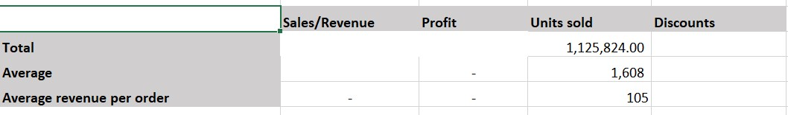

# Sales data analysis

## Introduction
The goal of this task is to demonstrate proficiency in data analysis using basic Excel functions such as filter, and calculating summary statistics, such as the sum, average, and count of values in a sales analysis dataset.

## Problem Statement
1.	Which of the employees are freelancers?
2.	What is the first name and last name of the employees?
3.	Check for employee name duplicates and highlight if any (do not delete)
4.	Highlight employees whose names begin with the letter ‘E’ (in green).
5.	What is the total revenue and profit generated? 
6.	What is the average revenue and Units Sold for every order?
7.	What is the total discount given in $?
8.	What is the total number of sales recorded?
9.	What is the highest Profit generated?
10.	Create a new column named ‘Sales Range’, returns ‘High Sales’ if the Sales value is above average, otherwise, return ‘Low Sales’.?
 
## Data Sourcing
the dataset contains information about the financial performance of 700 different entities over time. The data is organized into 16 columns, each of which represents a different financial metric, such as sales, profit, and discounts.
## Data Transformation & Cleaning
The data was cleaned and filtered to make it easier to analyze. This includes formatting the text and number types to make sure that there are no errors.
## Analysis

**Which of the employees are freelancers?**

This was carried out using the filter button in Excel. 

**What is the first name and last name of the employees?**

To split columns we use Text to Column option in Excel.

## Check for employee name duplicates and highlight if any (do not delete)
This was carried out using the Concat function in excel. The result is shown in the picture below

## Highlight employees whose names begin with the letter ‘E’.
This was carried out using the filter button in Excel.

## What is the total revenue and profit generated? 
This was carried out using the SUM function in excel to calculate the total revenue and profit. The result is shown in the picture below.

## 	What is the average revenue and Units Sold for every order?
The average revenue and units sold was calculated using the AVERAGE function in Excel. The result is shown in the image below.

## What is the total discount given in $?
The total discount was calculated using the SUM function and the result is $9,205,248.24. It is shown in the image below.

## What is the total number of sales recorded?
This was carried out using the Count function. The result achieved is shown in the image below.

## What is the highest Profit generated?
This was carried out using the MAX function. The result achieved is shown below.

## Create a new column named ‘Sales Range’, returns ‘High Sales’ if the Sales value is above average, otherwise, return ‘Low Sales’.?
The sales range was developed using the IF function. The achieved result is shown below.

## Analysis summery 
The analysis of the profit and sales in the analysis sheet, shows the company's profit and sales have increased steadily over the four quarters. The profit for Q4 is the highest, at $7,527,235.00, and the sales for Q4 are also the highest, at $51,690,104.00. The profit for Q4 is 15%, which is also the highest for the four quarters.
The average revenue and number of units sold per order is 105 units per order. This means that, on average, each order contains 105 units and generates 105 units of revenue. The analysis showed a gradual increase in the number of units sold per order indicating that customers are buying more units per order, on average. 
From January to December the total number of discounts was $9,205,268, and the highest profit generated was $262,200. The average sales were $169,609. and 228 transaction was above the average sales and 472 transactions were low sales 

## Conclusion and Recommendations
Overall, the company's profit and sales performance is very good. The company is growing rapidly and becoming more profitable. But the sales team should pay more attention to the number of discounts and should not be more than the average sales for each transaction.
